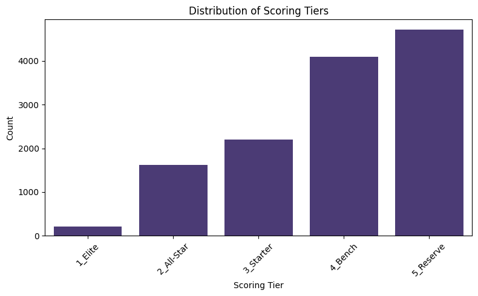
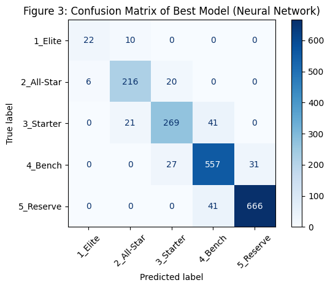

# NBA Player Scoring Tier Classifier


A multi-class ML classifier predicting which of 5 scoring tiers an NBA player belongs to (Elite / All-Star / Starter / Bench / Reserve), based purely on per-season box-score statistics. Benchmarked 6 models with class-imbalance handling and macro F1 optimization.

**[Full written report (PDF)](./NBA_Scoring_Tier_Report.pdf)** · **[Notebook](./FINAL_PROJECT_ML.ipynb)** · **[🚀 Try Interactive Demo on Kaggle](https://www.kaggle.com/code/samueldiffo/nba-scoring-tier-classifier)**

## Problem

NBA player evaluation traditionally leans on subjective scouting. This project tests whether standard box-score statistics alone are enough to objectively and automatically classify a player's role and tier.

- **Dataset**: [NBA Player Stats – All Seasons](https://www.kaggle.com/datasets/justinas/nba-players-data) (Kaggle), 27 seasons (1996–97 to 2022–23)
- **Scope after cleaning**: 12,844 player-season records, 23 features
- **Target**: `scoring_tier` — 5-class label (1_Elite → 5_Reserve)

## Key Challenge: Severe Class Imbalance



Reserve and Bench players together make up 69% of the data; Elite scorers are just 1.7%. This isn't sampling noise — it reflects the real NBA roster pyramid (every team has a handful of stars and many role players).

**Why this matters:**
1. **Macro F1** was used as the primary metric instead of accuracy, since accuracy would reward a model that just predicts "Bench" or "Reserve" every time.
2. **SMOTE was tested and rejected.** I ran every model with and without SMOTE oversampling. SMOTE improved Elite-class recall in isolation but *degraded* macro F1 across all six models — it introduced synthetic data noise that hurt generalization on the true distribution.

## Models & Results

Six models were trained with 5-fold stratified cross-validation (Logistic Regression, Decision Tree, SVC, Random Forest, Gradient Boosting, Neural Network), each tuned via grid or randomized search.

| Model | Test Accuracy | Test F1 (macro) | CV Std Dev |
|---|---|---|---|
| **SVC (RBF, C=10)** | **92.06%** | **0.8974** | **0.0031 (lowest)** |
| Neural Network [128→64] | 90.97% | 0.8869 | — |
| Gradient Boosting | 84.85% | 0.8077 | — |
| Logistic Regression (C=10) | 86.14% | 0.8414 | 0.0041 |
| Random Forest (300 trees) | 79.61% | 0.7535 | 0.0073 |
| Decision Tree (depth=15) | 79.24% | 0.7476 | 0.0082 |

**Model recommendation depends on the deployment goal, not just the top score:**
- **SVC** — best accuracy *and* the most stable generalization (lowest CV variance). Preferred choice when reproducibility matters.
- **Neural Network** — highest macro F1, best when minority-class (Elite) recall is the priority.
- **Logistic Regression** — within ~5 F1 points of the top models while remaining fully interpretable — the right call when stakeholders need to see *why* a player was classified a certain way.



The confusion matrix confirms the hardest boundary is Starter/Bench — statistically the most similar tiers — while Elite and Reserve (the most statistically distinct roles) are the cleanest predictions.

## What Drives Tier Classification

Across all six models, **points per game, usage %, and true shooting %** consistently ranked as the top predictors — offensive volume and efficiency dominate over rebounding, assists, or biographical factors.

## Methodology Highlights

- Stratified 70/15/15 train/validation/test split, reused identically across all six models for fair comparison
- Preprocessing (imputation, scaling, one-hot encoding) fit only on training folds — no leakage
- High-cardinality identifiers (player name, season, team) dropped to prevent label leakage
- SMOTE evaluated via `imblearn` Pipeline (fit on training folds only) — see rejection rationale above

## Installation & Quick Start

```bash
# Clone the repo
git clone https://github.com/samueldiffo99/NBA-scoring-tier-classifier.git
cd NBA-scoring-tier-classifier

# Install dependencies
pip install -r requirements.txt

# Run the notebook
jupyter notebook FINAL_PROJECT_ML.ipynb
```

## Repo Structure

```
FINAL_PROJECT_ML.ipynb      -- full pipeline: EDA, preprocessing, 6 models, evaluation
NBA_Scoring_Tier_Report.pdf -- written report (methodology, results, analysis, next steps)
figures/                    -- key visualizations (target distribution, confusion matrix)
requirements.txt            -- Python dependencies
```

## Next Steps

- Class-weighted loss or targeted SMOTE on the Elite class only, to lift minority recall without hurting majority-class precision
- Career-trajectory features (rolling averages, year-over-year deltas) instead of single-season snapshots
- Stacked ensemble (Neural Network + SVC as base learners, Logistic Regression as meta-learner)

## Tech Stack

Python · scikit-learn · imbalanced-learn · pandas · TensorFlow/Keras · matplotlib/seaborn
